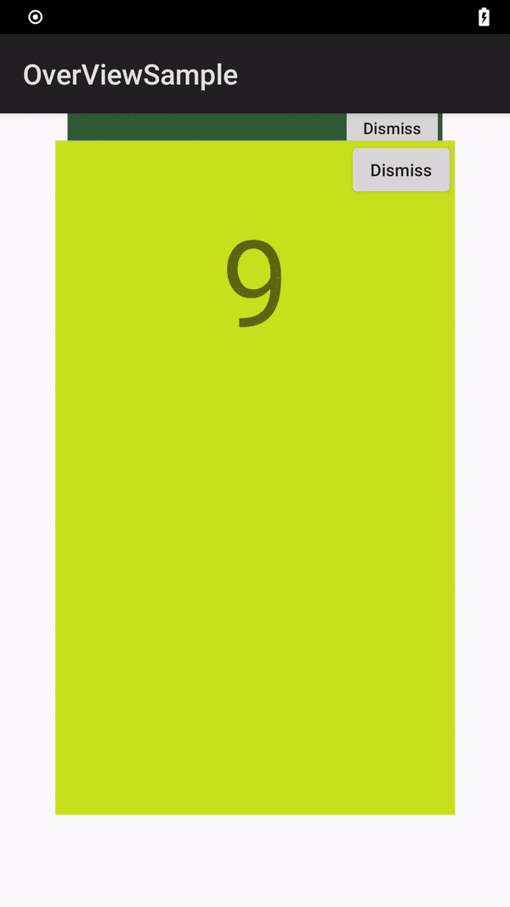

# StackOverView
> 仿安卓5.0最近任务（后台管理）界面  
> Mimic Task Recents Screen of Lollipop (Android 5.0 ~ Android 8.1)  

### Demo

### Dependents
- Base on: [github.com/Bossyao168/StackOverView](https://github.com/Bossyao168/StackOverView)
- Reference: [AOSP SystemUI](https://android.googlesource.com/platform/frameworks/base/+/refs/tags/android-cts-5.0_r4/packages/SystemUI/src/com/android/systemui/recents/)
  